# ResFit: Resume Tailor AI 📄

ResFit is a powerful Streamlit application that leverages advanced Large Language Models (LLMs) to intelligently tailor your resume for specific job descriptions. By analyzing your existing resume and the target job requirements, it rewrites content to highlight relevant skills and experiences, generating a professionally formatted PDF using LaTeX.

**Why ResFit?**
The main motivation behind this project was to solve a common problem with existing resume tailoring tools: they often strip out or break hyperlinks. **ResFit is designed specifically to preserve all the links** (portfolio, LinkedIn, GitHub, etc.) that you've carefully added to your original resume.

## 🚀 Features

- **Link Preservation**: Unlike many other tools, ResFit ensures all your hyperlinks remain intact in the final PDF.
- **Multi-Provider Support**: Choose your preferred AI model from **Google Gemini**, **Anthropic Claude**, or **OpenAI**.
- **Intelligent Tailoring**: Uses structured prompting to rewrite resume sections (Summary, Experience, Skills, Projects) specifically for the target role.
- **High-Performance**: Built with `asyncio` and parallel processing to tailor multiple sections concurrently for fast results.
- **Professional Output**: Generates high-quality, ATS-friendly PDFs using LaTeX templates.
- **Live Feedback**: Real-time logging interface shows you exactly what the AI is working on.
- **Dual Export**: Download both the final **PDF** and the raw **LaTeX (.tex)** source code for further manual editing.
- **Dockerized**: Ready-to-deploy container with all dependencies, including a full LaTeX environment.

## 🛠️ Tech Stack

- **Frontend**: [Streamlit](https://streamlit.io/)
- **LLM Orchestration**: [Instructor](https://python.useinstructor.com/)
- **PDF Processing**: [PyMuPDF4LLM](https://pymupdf.readthedocs.io/en/latest/)
- **Document Generation**: LaTeX (via `pdflatex`) & Jinja2 templating
- **Concurrency**: Python `asyncio` & `Semaphores`

## 🏗️ Architecture

```mermaid
%%{init: {
  'theme': 'base',
  'themeVariables': {
    'primaryColor': '#E1F5FE',
    'primaryTextColor': '#01579B',
    'lineColor': '#546E7A',
    'clusterBkg': '#FAFAFA',
    'clusterBorder': '#CFD8DC'
  },
  'flowchart': {
    'curve': 'linear',
    'nodeSpacing': 50,
    'rankSpacing': 60
  }
}}%%

graph TD

    %% === STYLING DEFINITIONS ===
    classDef user fill:#fff9c4,stroke:#fbc02d,stroke-width:2px,rx:10;
    classDef ui fill:#e1f5fe,stroke:#0288d1,stroke-width:2px,rx:5;
    classDef ai fill:#ffe0b2,stroke:#f57c00,stroke-width:2px,rx:10;
    classDef process fill:#ffffff,stroke:#78909c,stroke-width:2px,rx:5;
    classDef data fill:#e1bee7,stroke:#8e24aa,stroke-width:2px,shape:cylinder;
    classDef output fill:#c8e6c9,stroke:#2e7d32,stroke-width:2px,rx:5;

    %% === THE DIAGRAM ===

    %% 1. USER INTERFACE LAYER
    subgraph UI_Layer ["🖥️ Frontend / Interface"]
        User([👤 User]):::user
        Streamlit[/"💻 Streamlit UI"/]:::ui
        LLM["🧠 LLM Provider<br/>(OpenAI / Gemini / Claude)"]:::ui
        
        User -->|Uploads Files| Streamlit
        Streamlit -.->|Configures| LLM
    end

    %% 2. THE PIPELINE (BACKEND)
    subgraph Backend ["⚙️ ResumeTailor Pipeline"]

        %% Phase 1: Ingestion
        subgraph P1 ["Phase 1: Input Processing"]
            Parser["📄 Resume Parser<br/>(PyMuPDF4LLM)"]:::process
            Scraper["🌐 Job Scraper<br/>(Web Engine)"]:::process
        end

        %% Phase 2: Understanding
        subgraph P2 ["Phase 2: AI Orchestration"]
            Extractor{{"🤖 Data Extractor"}}:::ai
            Planner["📝 Section Planner"]:::process
            
            %% Connecting P1 to P2
            Parser --> Extractor
            Scraper --> Extractor
            Extractor --> Planner
        end

        %% Phase 3: Writing
        subgraph P3 ["Phase 3: Parallel Writing"]
            Workers{{"⚡ Async Workers"}}:::ai
            
            S1["📝 Summary"]:::process
            S2["💼 Experience"]:::process
            S3["🛠️ Skills"]:::process
            S4["🚀 Projects"]:::process

            Planner --> Workers
            Workers --> S1
            Workers --> S2
            Workers --> S3
            Workers --> S4
        end

        %% Phase 4: Assembly
        subgraph P4 ["Phase 4: Generation"]
            Merger["🔗 Jinja2 Merger"]:::process
            Compiler["⚙️ PDF Compiler<br/>(LaTeX)"]:::process
            
            S1 --> Merger
            S2 --> Merger
            S3 --> Merger
            S4 --> Merger
            Merger --> Compiler
        end
    end

    %% 3. OUTPUT
    Result([📄 Final PDF]):::output

    %% === CROSS CONNECTIONS ===
    Streamlit --> Parser
    Streamlit --> Scraper
    
    Compiler --> Result
```



## 📋 Prerequisites

- **API Keys**: You will need an API key from at least one of the supported providers:
  - [Google AI Studio](https://aistudio.google.com/) (Gemini)
  - [Anthropic Console](https://console.anthropic.com/) (Claude)
  - [OpenAI Platform](https://platform.openai.com/) (GPT)

## 🐳 Quick Start with Docker (Recommended)

The easiest way to run the application is using Docker, as it handles the complex LaTeX dependencies automatically.

1. **Clone the repository**
   ```bash
   git clone https://github.com/yourusername/resumer.git
   cd resumer
   ```

2. **Build and Run**
   ```bash
   docker-compose up --build
   ```

3. **Access the App**
   Open your browser and navigate to `http://localhost:8501`.

## 💻 Local Installation

If you prefer to run it locally, you'll need Python 3.12+ and a LaTeX distribution installed on your system.

1. **Install System Dependencies (LaTeX)**
   - **macOS**:
     ```bash
     brew install --cask mactex-no-gui
     ```
   - **Ubuntu/Debian**:
     ```bash
     sudo apt-get update
     sudo apt-get install -y texlive-latex-base texlive-fonts-recommended texlive-fonts-extra texlive-latex-extra
     ```

2. **Set up Python Environment**
   ```bash
   python -m venv venv
   source venv/bin/activate  # On Windows: venv\Scripts\activate
   pip install -r requirements.txt
   ```

3. **Run the Application**
   ```bash
   streamlit run app.py
   ```

## 📖 Usage Guide

1. **Select Provider**: Choose your AI provider (Gemini, Claude, or OpenAI) from the sidebar and select a specific model (e.g., `gemini-2.5-pro`, `claude-3-5-sonnet`).
2. **Enter Credentials**: Paste your API Key.
3. **Upload Resume**: Upload your current resume in PDF format.
4. **Job Details**:
   - Paste a URL to a job posting (the app will scrape it).
   - OR paste the raw job description text directly.
5. **Generate**: Click **"Tailor Resume"**.
6. **Download**: Once complete, download your new tailored PDF or the LaTeX source file.

## 📂 Project Structure

```
resumer/
├── app.py                 # Main Streamlit application entry point
├── Dockerfile             # Docker configuration
├── docker-compose.yml     # Docker Compose services
├── requirements.txt       # Python dependencies
├── resumer/               # Core package
│   ├── __init__.py        # Main pipeline logic (ResumeTailorPipeline)
│   ├── structures.py      # Pydantic models for structured data
│   ├── prompts/           # LLM system prompts
│   ├── schemas/           # JSON schemas for extraction
│   ├── templates/         # Jinja2 LaTeX templates
│   └── utils/             # Helper functions (PDF parsing, LaTeX ops)
└── notebooks/             # Jupyter notebooks for testing components
```

## 🤝 Contributing

Contributions are welcome! Please feel free to submit a Pull Request.

## 📄 License

MIT License

## 🙏 Acknowledgements

This project is inspired by [ResumeFlow](https://github.com/Ztrimus/ResumeFlow) by Ztrimus.